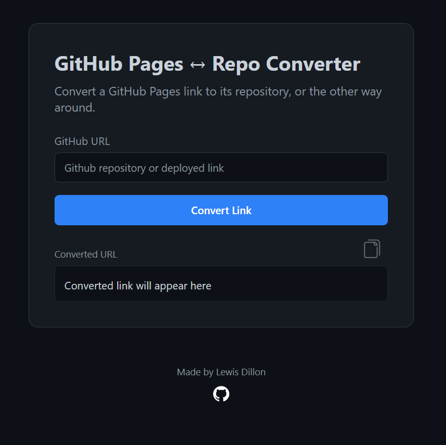

# GitHub Link Getter




## Description
GitHub Link Getter is a simple web-based tool designed to help users quickly retrieve and manage GitHub repository links. With an intuitive interface, it allows users to easily copy and share repository URLs.

## Features
- Retrieve GitHub repository links quickly.
- User-friendly interface.
- Lightweight and responsive design.

## Project Structure
```
index.html
assets/
    css/
        style.css
    img/
    js/
        script.js
```

## Usage
1. Clone the repository:
   ```bash
   git clone https://github.com/LewisMDillon/github-link-getter.git
   ```
2. Open `index.html` in your browser.
3. Use the interface to retrieve GitHub links.

## Technologies Used
- HTML
- CSS
- JavaScript


## Author
Lewis Dillon